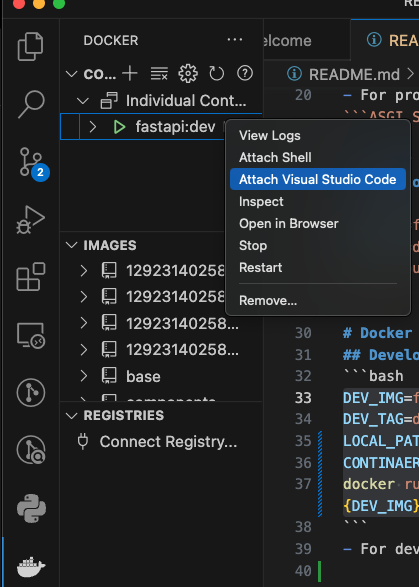
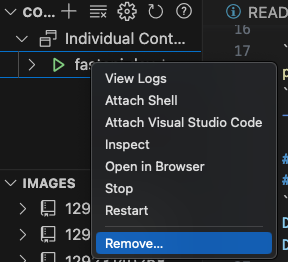
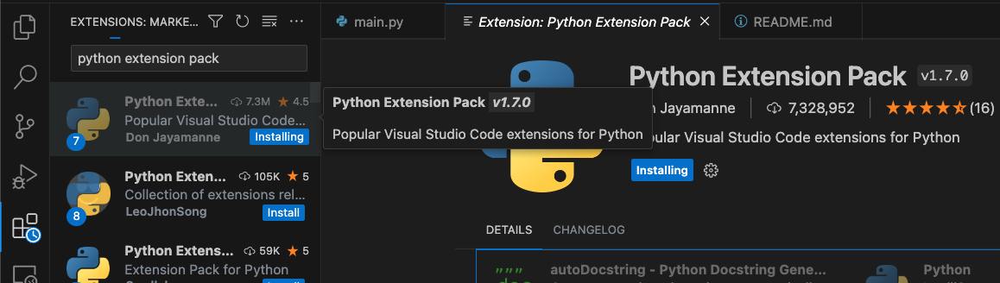
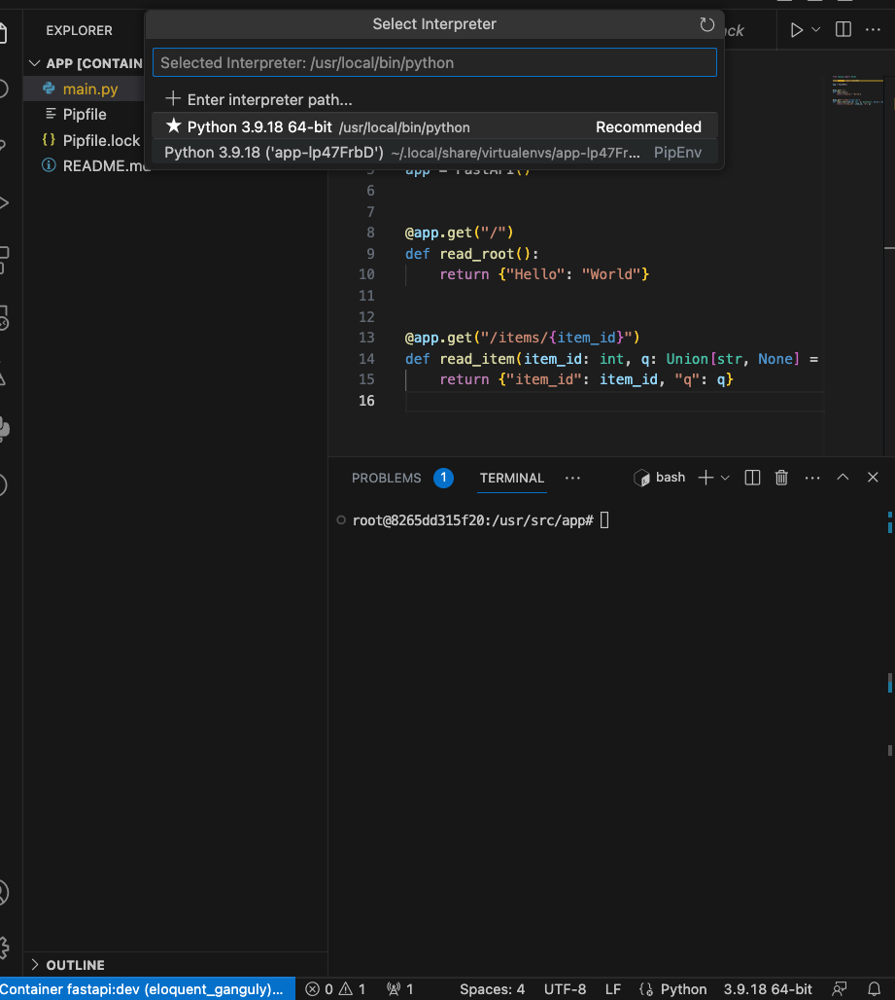

# FastAPI
- For Studying Python Backend

# Reference
- [FastAPI documentation](https://fastapi.tiangolo.com/ko/)

# Overview
- I studied fastapi using docker environment
- FastAPI's Web part is supported ```starlette```
- FastAPI's data part is supported ```Pydantic```

# Develop Environment
## docker build
```bash
DEV_IMG=fastapi
DEV_TAG=dev
docker build -f Dockerfile.dev -t ${DEV_IMG}:${DEV_TAG} .
```

## docker run
```bash
DEV_IMG=fastapi
DEV_TAG=dev
LOCAL_PATH=./a_example
CONTINAER_PATH=/usr/src/app
LOCAL_PORT=8000
CONTAINER_PORT=8000
docker run --rm -t -d -v ${LOCAL_PATH}:${CONTINAER_PATH} -p ${LOCAL_PORT}:${CONTAINER_PORT} --name ${DEV_TAG} ${DEV_IMG}:${DEV_TAG}
```
- For develop, run docker environment
- It is exist shared volume between LOCAL_PATH and CONTAINER_PATH. When you develop on docker, you would check files on LOCAL_PATH in the real-time

## docker stop
```bash
DEV_TAG=dev
docker stop ${DEV_TAG}
```
## vscode setup and access
<p align="center">
    
</p>

- We can develop app using vscode. click and setup open folder to ```/usr/src/app```

<p align="center">
    
</p>

- We can delete or stop docker environment

<p align="center">
    
</p>

- Install Python Extension Pack

## Installation FastAPI
```bash
pipenv --python 3.9
```
- Setup Python 3.9

<p align="center">
    
</p>

- Setup your virtual python environment
- For Example, if you make python file like a ```main.py(fastapi app)```, would click it and click more right bottom pannel, is Python environment setting

```bash
pipenv install fastapi
```

```bash
pipenv install "uvicorn[standard]"
```
- For production, we can install ```uvicorn```, which is ```ASGI Server```
