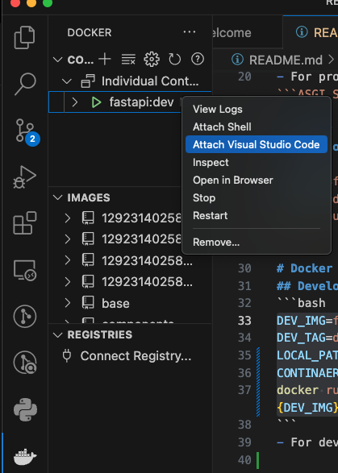

# FastAPI
- For Studying Python Backend

# Reference
- [FastAPI documentation](https://fastapi.tiangolo.com/ko/)

# Overview
- I studied fastapi using docker environment
- FastAPI's Web part is supported ```starlette```
- FastAPI's data part is supported ```Pydantic```

# Installation
```bash
pip install fastapi
```

```bash
pip install "uvicorn[standard]"
```
- For production, we can install ```uvicorn```, which is ```ASGI Server```

# Docker build
## Develop
```bash
DEV_IMG=fastapi
DEV_TAG=dev
docker build -f Dockerfile.dev -t ${DEV_IMG}:${DEV_TAG} .
```

# Docker run
## Develop
```bash
DEV_IMG=fastapi
DEV_TAG=dev
LOCAL_PATH=a_example
CONTINAER_PATH=/usr/src/app
docker run --rm -t -d -v ${LOCAL_PATH}:${CONTINAER_PATH} ${DEV_IMG}:${DEV_TAG}
```
- For develop, run docker environment


- We can develop app using vscode
