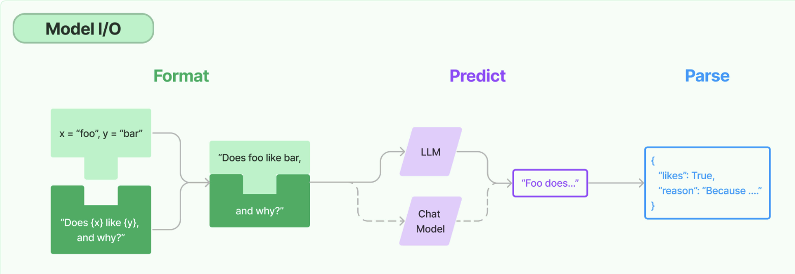

# Model I/O

- Prompt : Variable과 미리 만들어놓은 Template이 합쳐져 모델의 Input으로 사용된다.
- LLM/ChatModels : Model I/O의 Core. LLM은 input이 string, ChatModels는 list of message이다.
- Output Parser : Core의 Response에서 유용한 정보를 추출하고 의도한대로 출력을 내뱉어준다.
